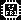
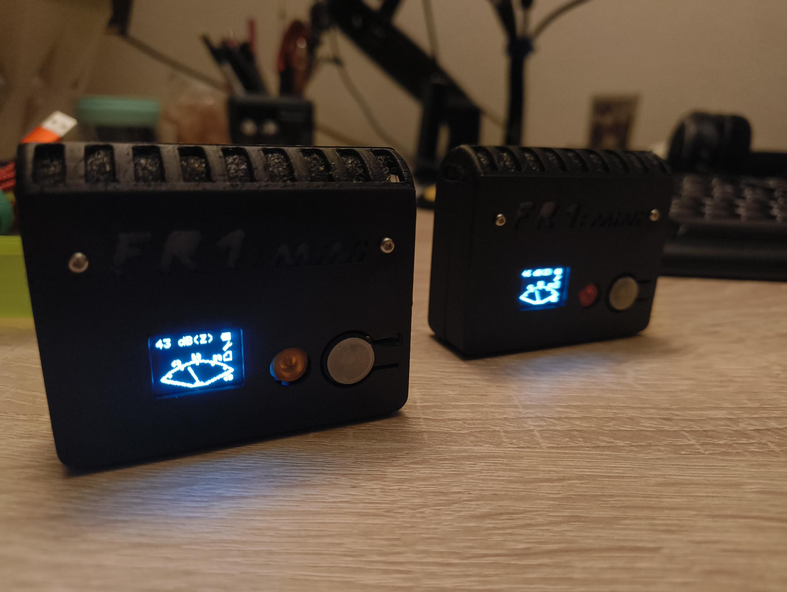
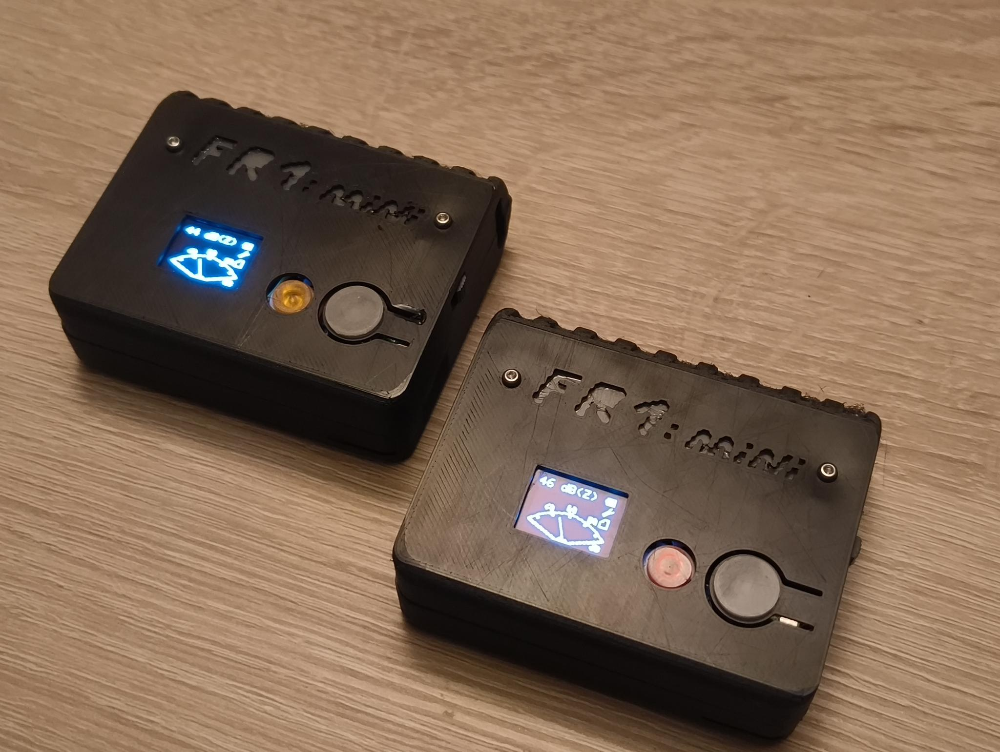

# FR1-mini
|||||
|-|-|-|-|
||||Powered by |

## About
The **FR1-mini** is the fast prototype combination of FR0 assets and the new, not yet released FR2 internal driver code. It is a **small**, **portable**, **open**, **single channel** field recorder with 64x48 pixel display and a minimalist UI.

|Frontal|Top|
|-|-|
|||

## Specs
- Chip: ESP32
- Mic: Adafruit MEMS Mic
- 200 mAh LiPo
- 2 control buttons
- Monochrome OLED

## Disclaimer
This project happended in a rush to meet the christmas gift deadline. It is not fully stable and will be expanded!